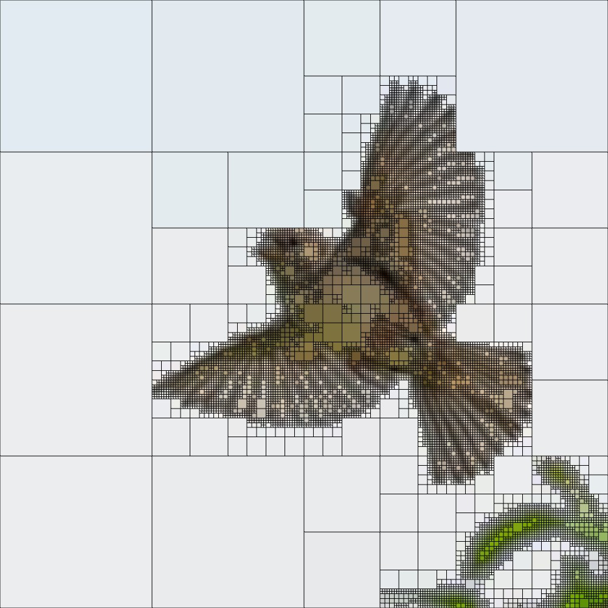

# Quadtree_subdivision
This project recursively divides an image into sections based on color variation. If a section has a high color variation, it will be subdivided further. Once a specified threshold is reached, the average color of that section is saved and later redrawn on the canvas.

### Adjustable parameters

By default, the program starts with the entire image as the initial section to divide. The threshold for subdivision is dynamically controlled by the x-coordinate of the user's cursor within the window.

